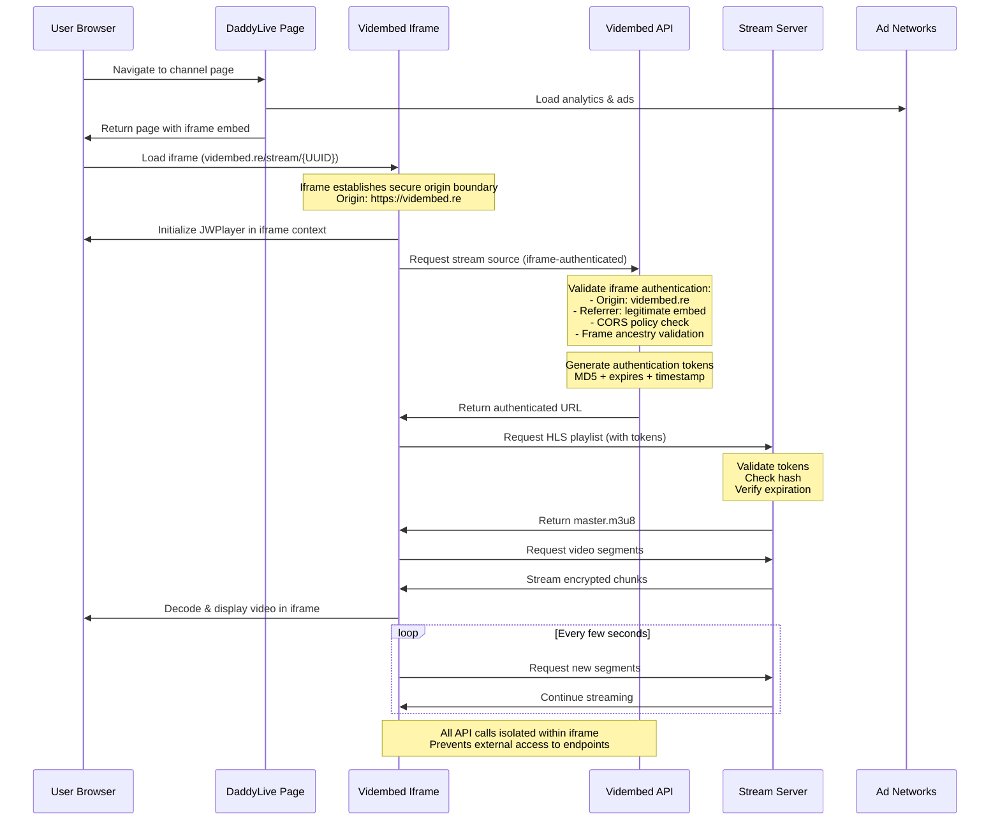

# DaddyLive Channel Streaming Architecture Analysis

## Overview

DaddyLive operates a multi-layered streaming platform that uses third-party video hosting services, token-based authentication, and sophisticated anti-hotlinking measures to deliver live TV channels through web browsers.

## Channel Architecture Flow

### 1. Frontend Channel Pages

Each channel is hosted on individual PHP pages following the pattern:
```
https://thedaddy.top/stream/stream-{ID}.php
```

**Example:** `stream-588.php` hosts "Sky Sport Select 1 NZ HD"

### 2. Video Embedding Strategy

DaddyLive doesn't host video content directly. Instead, it embeds streams from third-party services using iframe isolation for security:

**Primary Embed Service:** `vidembed.re`
- Embed URL pattern: `https://vidembed.re/stream/{UUID}`
- Each channel gets a unique UUID identifier
- Example: `dbd34bec-ad3f-463b-ba3b-dc7ef0a5a20e`

**Iframe Authentication Layer:**
The vidembed.re service is embedded within an iframe, which serves as a critical authentication boundary:

```html
<iframe src="https://vidembed.re/stream/dbd34bec-ad3f-463b-ba3b-dc7ef0a5a20e" 
        width="926" height="500" 
        frameborder="0" 
        allowfullscreen>
</iframe>
```

**Iframe-Based Security Controls:**
- **Origin Validation**: API calls must originate from the vidembed.re iframe domain
- **Referrer Checking**: Server validates that requests come from legitimate embed contexts
- **Cross-Origin Restrictions**: CORS policies prevent direct API access from unauthorized domains
- **Frame Ancestry**: Ensures iframe is embedded only on authorized parent domains

### 3. Authentication Chain with Iframe Isolation

#### Step 1: Initial Embed Load with Iframe Boundary
```
https://vidembed.re/stream/{UUID}
```
- Loads within iframe sandbox on DaddyLive page
- Establishes secure origin boundary for subsequent API calls
- Initializes JWPlayer with crypto-js for decryption
- Sets up cross-origin communication channels

#### Step 2: Iframe-Authenticated Stream Source API Call
```
https://www.vidembed.re/api/source/{UUID}?type=live
```
**Critical Authentication Requirements:**
- **Origin Header**: Must be `https://vidembed.re` (iframe domain)
- **Referrer Header**: Must show legitimate iframe embed context
- **CORS Validation**: Server validates cross-origin request permissions
- **Frame Context**: API verifies call originates from authorized iframe

**Iframe Security Benefits:**
- Prevents direct API calls from unauthorized domains
- Creates isolated execution context for authentication tokens
- Enables secure cross-origin communication while blocking external access
- Provides additional layer against API endpoint discovery/abuse

#### Step 3: Final Stream URL Generation with Token Validation
```
https://{obfuscated-domain}/v3/director/{encoded-path}/master.m3u8?md5={hash}&expires={timestamp}&t={request_time}
```

## Token-Based Security System

### Authentication Parameters

| Parameter | Purpose | Example |
|-----------|---------|---------|
| `md5` | Hash validation | `m8xPUrqzrWXRNJxlXN_3wA` |
| `expires` | Token expiration | `1755427007` (Unix timestamp) |
| `t` | Request timestamp | `1755383807` |

### Security Features

1. **Time-Limited Access**
   - Tokens expire approximately 12 hours after generation
   - Prevents long-term URL sharing

2. **Hash Validation**
   - MD5 hash prevents URL parameter manipulation
   - Server validates hash against request parameters

3. **Domain Obfuscation**
   - Stream servers use non-obvious domains
   - Example: `5nhp186eg31fofnc.chinese-restaurant-api.site`

4. **Iframe-Based Access Control**
   - **Origin Isolation**: API calls must originate from vidembed.re iframe
   - **Referrer Validation**: Server checks legitimate embed context
   - **CORS Protection**: Cross-Origin Resource Sharing policies block unauthorized domains
   - **Frame Ancestry Checking**: Ensures iframe embedded only on authorized parent domains

5. **Anti-Direct Access Measures**
   - Direct API endpoint calls blocked via CORS
   - Authentication tokens only generated within iframe context
   - Prevents external scripts from accessing stream URLs

## Channel Operation Workflow

### For Each Channel:

1. **User Navigation**
   ```
   User → DaddyLive Channel List → Specific Channel Page
   ```

2. **Page Load Sequence with Iframe Embedding**
   ```
   stream-{ID}.php → Analytics/Ads → vidembed.re iframe (origin boundary)
   ```

3. **Iframe-Isolated Video Player Initialization**
   ```
   JWPlayer loads in iframe → Iframe-authenticated API call → Authenticated stream URL → HLS playback
   ```

4. **Secure Stream Delivery**
   ```
   HLS segments fetched from authenticated endpoints within iframe context
   ```

## Technical Implementation

### Player Technology
- **Video Player:** JWPlayer (with HLS.js provider)
- **Stream Format:** HLS (HTTP Live Streaming) - `.m3u8` playlists
- **Encryption:** Client-side crypto-js for token handling

### Infrastructure Components

1. **Frontend Servers:** `thedaddy.top`
2. **Embed Proxy:** `vidembed.re`
3. **Stream Servers:** Rotating obfuscated domains
4. **CDN/Analytics:** Multiple tracking and ad services

### Anti-Detection Measures

1. **Multiple Tracking Services**
   - HistStats, AdExchange, DTScout
   - Makes traffic appear legitimate

2. **Dynamic Domain Rotation**
   - Stream servers use different domains
   - Prevents easy blocking

3. **Legitimate Web Technologies**
   - Standard HTML5 video players
   - Common analytics frameworks

4. **Iframe Security Isolation**
   - **Origin-based Authentication**: API access restricted to vidembed.re iframe origin
   - **Cross-Origin Protection**: CORS policies prevent external script access
   - **Sandboxed Execution**: Video player runs in isolated iframe context
   - **Anti-Hotlinking**: Direct embedding blocked via frame ancestry checks

## Revenue Model

### Advertising Integration
- Multiple ad networks integrated
- Pre-roll and overlay advertisements
- Tracking pixels for user analytics

### Traffic Monetization
- User data collection through analytics
- Referral tracking systems
- Ad impression revenue

## Scalability Architecture

### Load Distribution
- Each channel operates independently
- Third-party hosting reduces server load
- CDN distribution for global access

### Reliability Measures
- Multiple backup embed services likely available
- Fallback streams for popular channels
- Geographic content distribution

## Legal Considerations

This analysis is purely technical and educational. The described system appears designed to:
- Obscure original content sources
- Prevent direct access to streams
- Maintain plausible deniability through third-party hosting

## Architecture Diagram

```mermaid
graph TD
    A[User Browser] --> B[DaddyLive Channel Page<br/>thedaddy.top/stream/stream-588.php]
    B --> C[Analytics & Ad Scripts<br/>histats, adsco.re, etc.]
    B --> D[Vidembed.re Iframe<br/>UUID: dbd34bec-ad3f-463b-ba3b-dc7ef0a5a20e<br/>ORIGIN: vidembed.re]
    
    D --> E[JWPlayer Initialization<br/>crypto-js loaded<br/>iframe sandbox context]
    E --> F[Iframe-Authenticated API Request<br/>vidembed.re/api/source/{UUID}?type=live<br/>Origin: https://vidembed.re<br/>Referrer: iframe context]
    
    F --> G[Authentication Token Generation<br/>MD5 hash + expires + timestamp<br/>CORS validation passed]
    G --> H[Authenticated Stream URL<br/>chinese-restaurant-api.site/v3/director/.../master.m3u8]
    
    H --> I[HLS Stream Segments<br/>Encrypted video chunks]
    I --> J[Video Playback<br/>Decoded in iframe context]
    
    K[Ad Networks] --> B
    L[Tracking Services] --> B
    M[CDN Services] --> H
    
    subgraph "Iframe Security Layer"
        N[Origin Isolation<br/>vidembed.re domain only]
        O[CORS Protection<br/>Blocks unauthorized domains]
        P[Referrer Validation<br/>Legitimate embed context]
        Q[Frame Ancestry<br/>Authorized parent domains]
    end
    
    subgraph "Token Security Layer"
        R[Time-Limited Tokens<br/>12-hour expiration]
        S[MD5 Hash Validation<br/>Prevents tampering]
        T[Domain Obfuscation<br/>Rotating server names]
    end
    
    F -.-> N
    F -.-> O
    F -.-> P
    D -.-> Q
    G -.-> R
    G -.-> S
    H -.-> T
    
    style A fill:#e1f5fe
    style B fill:#f3e5f5
    style D fill:#fff3e0
    style F fill:#e3f2fd
    style H fill:#e8f5e8
    style I fill:#fce4ec
```

## Detailed Flow Diagram



## Component Architecture

```mermaid
graph LR
    subgraph "Frontend Layer"
        A[Channel Pages<br/>stream-{ID}.php]
        B[CSS/JS Assets]
        C[Ad Scripts]
    end
    
    subgraph "Iframe Isolation Layer"
        D[Vidembed.re Iframe<br/>Origin Boundary]
        E[JWPlayer<br/>Sandboxed Context]
        F[Authentication API<br/>/api/source/]
    end
    
    subgraph "Stream Layer"
        G[Stream Servers<br/>Obfuscated Domains]
        H[HLS Segments<br/>.m3u8 playlists]
        I[CDN Distribution]
    end
    
    subgraph "Iframe Security Controls"
        J[Origin Validation<br/>vidembed.re only]
        K[CORS Protection<br/>Cross-origin blocks]
        L[Referrer Checking<br/>Embed context validation]
        M[Frame Ancestry<br/>Parent domain control]
    end
    
    subgraph "Token Security Layer"
        N[MD5 Hash Validation]
        O[Time Expiration]
        P[Domain Obfuscation]
    end
    
    A --> D
    D --> E
    E --> F
    F --> G
    G --> H
    H --> I
    
    D -.-> J
    F -.-> K
    D -.-> L
    D -.-> M
    F -.-> N
    F -.-> O
    G -.-> P
    
    style A fill:#ffebee
    style D fill:#e3f2fd
    style F fill:#f1f8e9
    style G fill:#e8f5e8
    style J fill:#fff3e0
    style N fill:#fce4ec
```

## Conclusion

DaddyLive operates a sophisticated streaming proxy system that leverages third-party services, token-based authentication, and multi-layered obfuscation to deliver live TV content while minimizing direct legal exposure. Each channel follows the same architectural pattern but with unique identifiers and authentication tokens.